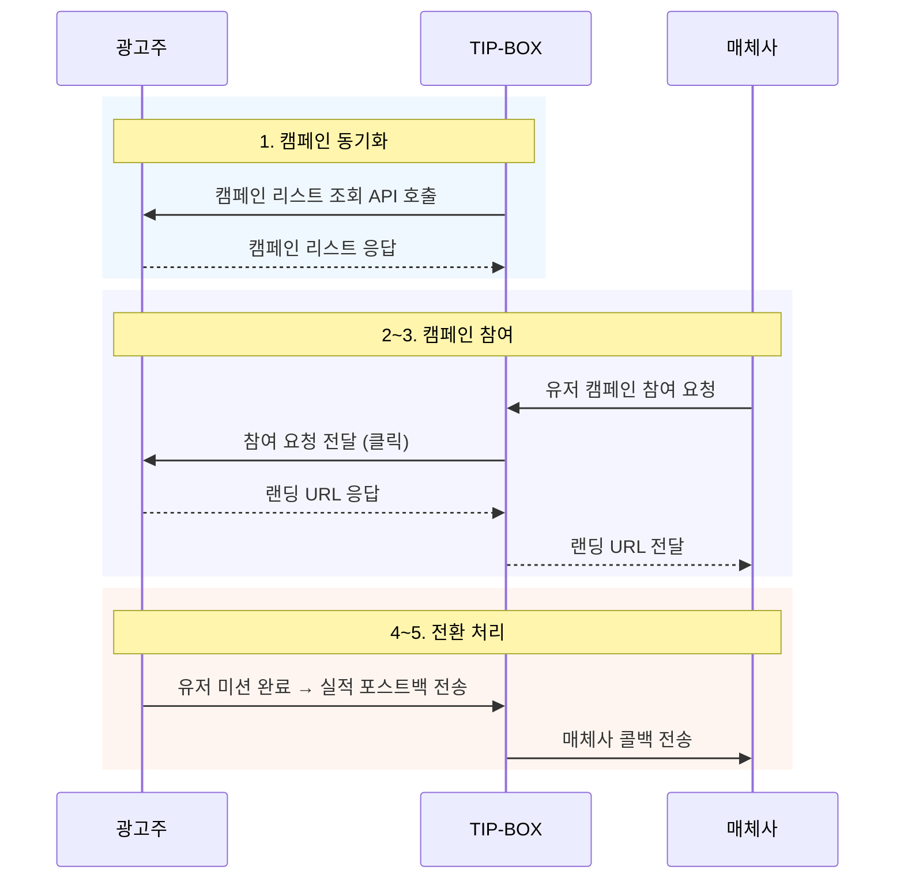

# Reward Campaign API guide for advertiser

### Getting Started

- 본 가이드는 귀사와 TIP-BOX와의 API 연동을 위한 가이드입니다
- 귀사의 캠페인을 TIP-BOX에게 제공함으로 TIP-BOX의 매체사들에게 캠페인을 노출시킬 수 있습니다

### 연동 흐름도



### Prerequisites

- 귀사의 캠페인 리스트 조회 API와 참여 요청 API를 TIP-BOX에 제공해야 합니다
- 유저 미션 완료 후 TIP-BOX로 실적 포스트백을 발송해야 합니다

---
# 1.동적 광고주 API 설정

TIP-BOX는 광고주의 기존 API 스펙에 맞추어 동적으로 연동할 수 있는 설정 기능을 제공합니다.
광고주가 이미 사용 중인 캠페인 리스트 API와 참여 요청 API가 있는 경우, TIP-BOX 어드민에서 필드 매핑을 설정하여 별도의 API 개발 없이 연동할 수 있습니다.

> 이 기능은 ADBC와의 주요 차이점으로, ADBC는 각 광고주별로 고정된 연동 코드가 필요했지만,
> TIP-BOX는 어드민 설정만으로 새로운 광고주를 추가할 수 있습니다.

### 동적 API 동기화 설정 항목

TIP-BOX 어드민에서 아래 항목을 설정하여 귀사의 API와 연동합니다.

#### 기본 설정

| 항목              | 설명                          | 비고                             |
|-------------------|-----------------------------|--------------------------------|
| apiUrl            | 캠페인 리스트 API 기본 URL          |                                |
| androidUrl        | Android 전용 API URL           | apiUrl 대신 OS별 URL 사용 시        |
| iosUrl            | iOS 전용 API URL               | apiUrl 대신 OS별 URL 사용 시        |
| advertiserCode    | 광고주 식별 코드                   | API 호출 시 인증 파라미터로 사용          |
| adFormat          | 광고 형식                       | OFFERWALL 또는 DISPLAY           |

#### 필드 매핑 설정

귀사의 API 응답에서 TIP-BOX가 인식해야 하는 필드명을 매핑합니다.

| 항목                | 설명                          | 예시                             |
|---------------------|-----------------------------|--------------------------------|
| dataArrayField      | 캠페인 배열이 포함된 JSON 필드 경로      | "camp", "data.campaigns"       |
| externalIdField     | 캠페인 식별값 필드명                  | "campid", "id"                 |
| nameField           | 캠페인명 필드명                     | "name", "title"                |
| priceField          | 단가 필드명                       | "price", "reward"              |
| totalQuantityField  | 총 수량 필드명                     | "totalquantity", "total_cap"   |
| dailyQuantityField  | 일별 수량 필드명                    | "quantity", "daily_cap"        |
| osField             | OS 필드명                       | "os", "platform"               |
| adTypeField         | 광고 유형 필드명                    | "bm", "ad_type"                |

#### 값 매핑 설정

귀사의 API에서 사용하는 값(코드)을 TIP-BOX 내부 값으로 변환합니다.

| 항목           | 설명                          | 예시                             |
|----------------|-----------------------------|--------------------------------|
| osMapping      | OS 값 변환 매핑                   | `{"AOS": "ANDROID", "IOS": "IOS"}` |
| adTypeMapping  | 광고 유형 변환 매핑                  | `{"1": "CPA", "2": "CPE"}`     |
| assetMapping   | 소재(creative) 필드 매핑           | `{"icon": "iconurl"}`          |
| fieldMapping   | 기타 사용자 정의 필드 매핑              | 귀사 응답의 커스텀 필드를 TIP-BOX 필드로 매핑 |

#### 설정 예시

귀사의 캠페인 리스트 API 응답이 아래와 같은 경우:

```json
{
    "status": "ok",
    "total": 5,
    "campaigns": [
        {
            "id": 1001,
            "title": "앱 설치 캠페인",
            "reward": 500,
            "platform": "AOS",
            "type": "CPI",
            "daily_limit": 100,
            "icon": "https://example.com/icon.png"
        }
    ]
}
```

TIP-BOX 어드민에서 아래와 같이 설정합니다:

```
dataArrayField     : campaigns
externalIdField    : id
nameField          : title
priceField         : reward
osField            : platform
adTypeField        : type
dailyQuantityField : daily_limit
osMapping          : {"AOS": "ANDROID", "IOS": "IOS"}
assetMapping       : {"icon": "iconurl"}
```

> 동적 API 설정에 대한 자세한 문의는 연동 담당자에게 문의해주세요.

---
# 2.TIP-BOX로 실적 전송 (포스트백)

- 사용자가 정상적으로 미션에 참여해 전환이 완료된 경우 TIP-BOX로 포스트백을 발송합니다
- method : GET
- TIP-BOX postback URL : `https://postback.tipbox.kr/api/postback`
  - adFormat : `offerwall` 또는 `display`
  - network : 연동 담당자가 안내하는 귀사의 네트워크명

### 파라미터

| 항목            | 형태     | 설명                               | 필수 |
|---------------|--------|----------------------------------|----|
| clickId       | string | 캠페인 참여시 전달받은 참여 식별 파라미터 (clickId) | O  |
| callbackParam | string | 귀사가 관리하는 트랜잭션 ID                 | O  |
| price         | int    | 수익금 (원)                          |    |

### 예시

```
https://postback.tipbox.kr/api/postback?clickId=abc123&callbackParam=tx_001&price=100
```

### 응답

| 항목     | 형태     | 설명       |
|--------|--------|----------|
| status | int    | HTTP 상태 코드 |
| code   | string | 응답 코드    |
| message | string | 응답 메시지   |

#### 포스트백 응답 예시

**성공**
```json
{
    "status": 200,
    "code": "SUCCESS",
    "message": "성공"
}
```

**실패 - 참여 이력 없음**
```json
{
    "status": 400,
    "code": "PARTICIPATE_NOT_FOUND",
    "message": "참여 이력을 찾을 수 없습니다"
}
```

---
## 부록: TrackerJS 스크립트 연동

광고주의 프로모션 웹페이지에서 스크립트 기반으로 전환을 추적하는 경우, 별도의 TrackerJS 연동 가이드를 참고해주세요.

- [TrackerJS integration guide for Advertiser](./CPA%20script%20integration%20guide%20for%20Advertiser.md)

---

## Authors

* **CHOI BAWOO** - *Integration technical support* - bw@adbc.co.kr


